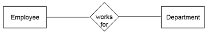
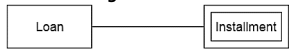
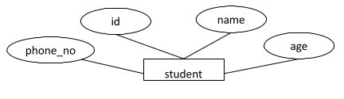
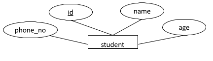
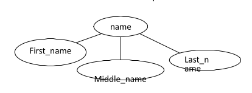
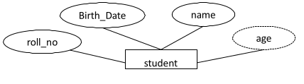
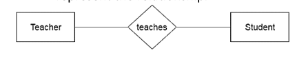
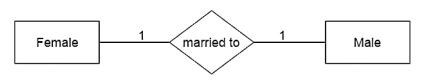
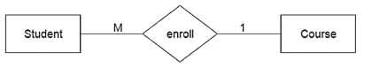
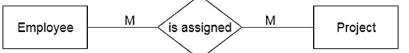

# $$\colorbox{cyan}{Modeling}$$

## $$\boxed{\text{1. Entity}}$$

* An entity may be any object, class, person or place. OR anything that is participating in the system.
* An **entity** can be represented as **rectangles**.

Here in the diagram **Employee** and **Department** are entities.

---

## $$\boxed{\text{2. Weak Entity}}$$

* An entity that depends on another
entity called a weak entity.
* The weak entity doesn't contain any key attribute of its own.
* The weak entity is represented by a **double rectangle**.

Here in the diagram **Installment** is a **weak** entity cause it depends upon **Loan** to be come into existence.

---

## $$\boxed{\text{3. Attribute}}$$

* The attribute is used to describe the property (characteristics) of an entity.
* **Eclipse** is used to represent an attribute.
* For example, id, age, contact number,
name, etc. can be attributes of a
student.

Here in the diagram **["phone_no","id","name","age"]** are the attributes of entity **student**.

---

## $$\boxed{\text{4. Primary key}}$$

* The key attribute is used to represent the main characteristics of an entity.
* It represents a **primary key**.
* The key attribute is represented by an **ellipse** with the text **underlined**.

Here in the diagram the **id** is a key attribute or primary key cause it is underlined.

---

## $$\boxed{\text{5. Composite Attribute}}$$

* An attribute that composed of many other attributes is known as a composite attribute.
* The composite attribute is represented by an **ellipse**, and those ellipses are connected with an **ellipse**.

Here in the diagram the **name** is a **composite attribute** cause it is making up of **["First_name","Middle_name","Last_name"]**.

---

## $$\boxed{\text{6. Multivalued attribute.}}$$

* An attribute can have more than one value.
* These attributes are known as a **multivalued attribute.**
* The **double oval** is used to represent
multivalued attribute.

Here in the diagram the **Phone_no** is a **multibalues attribute** cause any person can have more than one phone number.

---

## $$\boxed{\text{7. Derived attribute.}}$$

* An attribute that can be derived from other attribute is known as a **derived attribute**.
* It can be represented by a **dashed ellipse**.
* For example, A person's age changes over time and can be derived from another attribute like **Date of birth**.

Here in the diagram **age** is a **derived attribute** cause it can be derived from another attribute like **Date of birth**.

---

## $$\boxed{\text{8. Relationship.}}$$

* A **relationship** is used to describe the relation between entities. OR a logical connection between different entities.
* The relationship indicates how the entities are connected or related to each other.
* The entities that participate in a relationship are participants.
* **Diamond** or **rhombus** is used to represent the relationship.

Here in the diagram **Teacher** has a **relationship** with **Student**.

---

## $$\boxed{\text{9. Entity class.}}$$

* A group of entities of the same type is called entity class.
* All entities in an entity type share common characteristics.
* For example, STUDENT entity class is a collection all students.

---

## $$\boxed{\text{10. Entity Instance.}}$$

* A member of an entity class is also known as an entity instance.
* For example, a student Abdullah of STUDENT entity type is an entity instance.

---

## $$\boxed{\text{11. One to One Relationship.}}$$

* When only one instance of an entity is associated with the relationship, then it is known as **one to one relationship**.
* For example, A female can marry to one male, and a male can marry to one female.

---

## $$\boxed{\text{12. Many-to-One relationship}}$$

* When more than one instance of the entity on the left, and only one instance of an entity on the right associates with the relationship then it is known as a **many-to-one relationship**.
* For example, Student enrolls for only one course, but a course can have many students.

---

## $$\boxed{\text{13. Many-to-Many relationship}}$$

* When more than one instance of the entity on the left, and more than one instance of an entity on the right associates with the relationship then it is known as a **many-to-many relationship**.
* For example, Employee can assign by many projects and project can have many employees.

---

