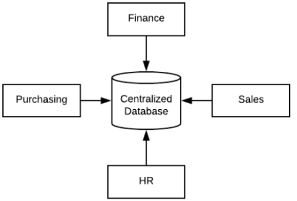
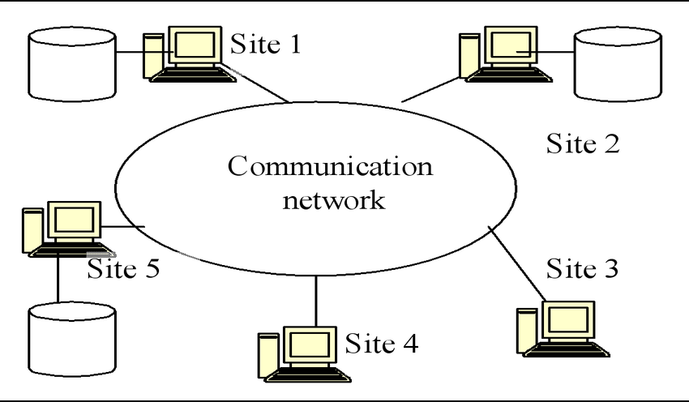
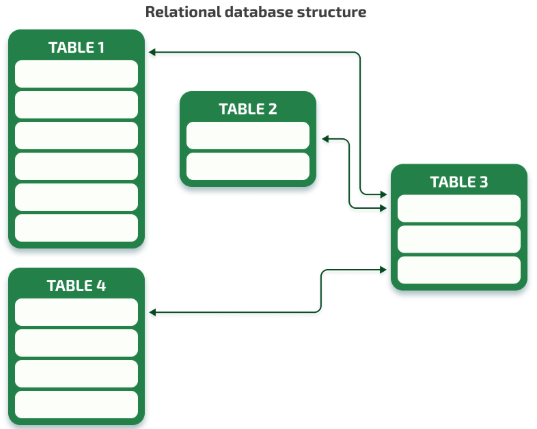
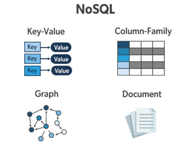
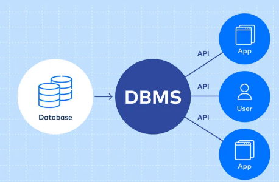
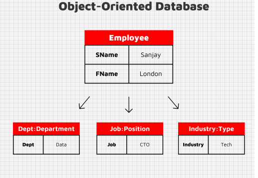
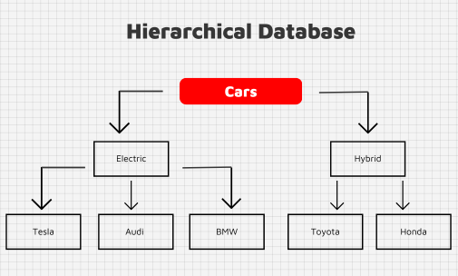
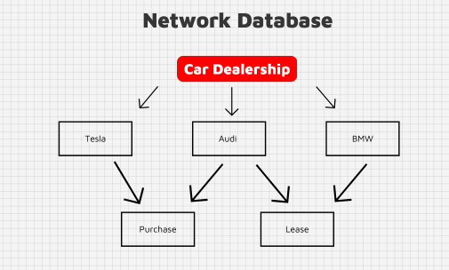
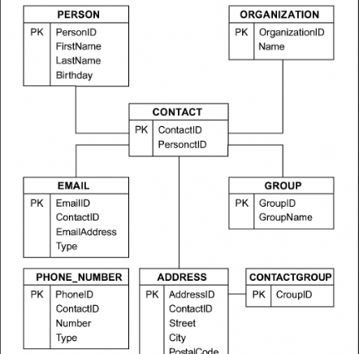
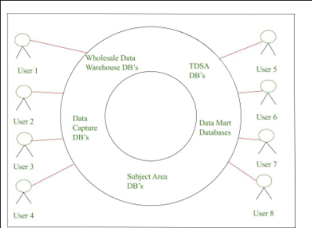

# $\text{Assignment 1 }$

$\text{Name: Jawad Ahmed}$
$\text{Roll No: 04}$

## $\text{Data Base Models or Types}$

Following are the some types or models of **DataBase**:

---

### $\text{1. Centralized Database}$

A centralized database is a type of database that is stored, managed, and maintained in a single central location, such as one server or a mainframe computer. All users and applications that need to access the data must do so through this central point.

#### $\text{Example}$

A university with a centralized database stores all student records, course registrations, and exam results on a single server.

#### $\text{Diagram}$

---

###

### $\text{2. Decentralized Database}$

A decentralized database is a type of database system where data is stored across multiple locations or devices, and no single central authority controls the entire database. Each location (or node) operates independently and may have its own processing power and storage.

#### $\text{Example}$

Blockchain technology (e.g., Bitcoin, Ethereum) uses a decentralized database model where each participant (node) has a copy of the ledger and validates transactions without relying on a central authority.

#### $\text{Diagram}$

---

### $\text{3. Relational Database}$

A Relational Database (RDB) is a type of database that stores data in tables (also called relations). Each table consists of rows (records) and columns (fields). It uses Structured Query Language (SQL) for querying and managing data.

#### $\text{Example}$

MySQL, PostgreSQL etc.

#### $\text{Diagram}$

---

### $\text{4. NO SQL}$

NoSQL stands for "Not Only SQL", and refers to a broad class of non-relational databases designed to handle large volumes of unstructured, semi-structured, or rapidly changing data. Unlike relational databases, NoSQL databases do not use fixed schemas or SQL as their primary query language.

#### $\text{Example}$

MongoDB is one the best example of NO SQL.

#### $\text{Diagram}$

---

### $\text{5. Cloud Database}$

A Cloud Database is a database that runs on a cloud computing platform rather than on-premises infrastructure. It can be hosted, managed, and accessed remotely via the internet. Cloud databases can be either SQL (relational) or NoSQL (non-relational), and they are designed to offer scalability, reliability, and flexibility.

#### $\text{Example}$

Amazon, Google Cloud, Microsoft etc.

#### $\text{Diagram}$

---

### $\text{6. Object-Oriented Database (OODB)}$

An Object-Oriented Database (OODB) is a type of database that integrates object-oriented programming principles with database technology. Instead of storing data in tables (like in relational databases), it stores data as objects, just like how data is represented in object-oriented programming languages (e.g., C++, Java, Python).

#### $\text{Example}$

db4o (Database for Objects), ObjectDB, Versant Object Database, InterSystems Caché, GemStone/S

#### $\text{Diagram}$

---

### $\text{7. Hierarchical Database}$

A Hierarchical Database is a type of database that organizes data in a tree-like structure. Data is stored in records (nodes), and each record is connected to its parent and children in a parent-child relationship. This structure is similar to a family tree or a folder directory in a computer.

#### $\text{Example}$

Early IBM Information Management System (IMS)

#### $\text{Diagram}$

---

### $\text{8. Network Database}$

The Network Database Model is a type of database model that represents data in a graph structure rather than a strict hierarchy. Unlike the hierarchical model, in the network model, a record (child node) can have multiple parent nodes, allowing for many-to-many relationships..

#### $\text{Example}$

IDMS (Integrated Database Management System), Raima Database Manager, TurboIMAGE

#### $\text{Diagram}$

---

### $\text{9. Personal Database}$

A Personal Database is a database system designed for use by a single user on a personal device, such as a PC or laptop. It is typically lightweight, easy to set up, and used for managing small amounts of data like contacts, budgets, projects, or personal collections.

#### $\text{Example}$

Microsoft Access, SQLite, MySQL

#### $\text{Diagram}$

---

### $\text{10. Operational Database}$

An Operational Database (also called an OLTP database, which stands for Online Transaction Processing) is a database that is used to manage and store real-time data generated from daily business operations. It supports fast read/write operations and is optimized for high-performance transactional tasks like insertions, updates, and deletions.

#### $\text{Example}$

PostgreSQL, MySQL, Microsoft SQL Server.

#### $\text{Diagram}$

It can be distributed, relational or any other.

---

### $\text{11. Enterprise Database}$

An Enterprise Database is a large-scale, robust, and secure database system designed to handle the complex and massive data needs of an entire organization or enterprise. These databases support thousands to millions of transactions, users, and applications across multiple departments, often in real-time.

#### $\text{Example}$

Oracle, SAP HANA etc.

#### $\text{Diagram}$

#### Notes about diagram

##### **Overall Structure (Concentric Circles)**

* The architecture is **circular**, with multiple **layers of databases** forming the center and **users** accessing them from the outside.
* Each layer stores different kinds of data and serves different purposes.

##### Outer Circle: **Users (User 1 to User 8)**

These are **end-users or applications** who need to access data.
They interact with the system to get data, reports, insights, etc.

##### Middle Ring: **Different Types of Databases**

This ring contains various databases which serve specific roles:

1. **Wholesale Data Warehouse DB’s**:

   * Main storage of integrated, historical data from all sources.
   * Acts as the central data repository.

2. **TDSA DB’s (Tactical Decision Support Applications)**:

   * Specialized databases used for quick tactical decision-making.
   * Likely optimized for speed and specific types of queries.

3. **Data Mart Databases**:

   * Smaller databases built for specific departments (e.g., sales, HR).
   * They get data from the warehouse but are more focused.

4. **Data Capture DB’s**:

   * Responsible for collecting data from various sources (operational systems).
   * This is where **raw data first enters** the system.

##### Inner Circle: **Subject Area DB’s**

* Organized around **specific subjects or business areas** (e.g., customer, product, sales).
* Helps in simplifying access and analysis for users focused on particular domains.

##### Flow of Data (Inside → Out)

1. Data is **captured** in **Data Capture DBs**.
2. It is **transformed, cleaned, and stored** in the **Wholesale Data Warehouse**.
3. This central warehouse feeds:

   * **Subject Area DBs** (thematic breakdown)
   * **Data Marts** (for specific user groups or departments)
   * **TDSA DBs** (for decision-making)
4. Finally, **users (User 1–8)** access the appropriate database depending on their needs.

---

### $\text{ACID Properties}$

**ACID** is an acronym that represents the **four key properties** that ensure reliable processing of **database transactions**. These properties are essential for maintaining **data integrity**, especially in systems that support **concurrent access** and **unexpected failures** (like power loss or crashes).

---

### 1. **A – Atomicity**

> Ensures that a **transaction is all-or-nothing**.

*Example:*
In a banking app, if you transfer money from Account A to Account B:

* Deducting from A and adding to B **must both succeed**.
* If one fails, the other **must be undone**.

---

### 2. **C – Consistency**

> Ensures that a transaction **leaves the database in a valid state**.

*Example:*
If there's a rule that no account balance can be negative, the system will **reject any transaction** that violates this.

---

### 3. **I – Isolation**

> Ensures that **concurrent transactions** do not interfere with each other.

*Example:*
Two users booking the last seat in a movie theater:

* Only one should succeed. Isolation ensures proper handling.

---

### 4. **D – Durability**

> Ensures that **once a transaction is committed**, it is **permanently saved**, even in case of power failure or crash.

*Example:*
If a bank confirms your transaction, it **must not be lost**, even if the system crashes right after.

---
