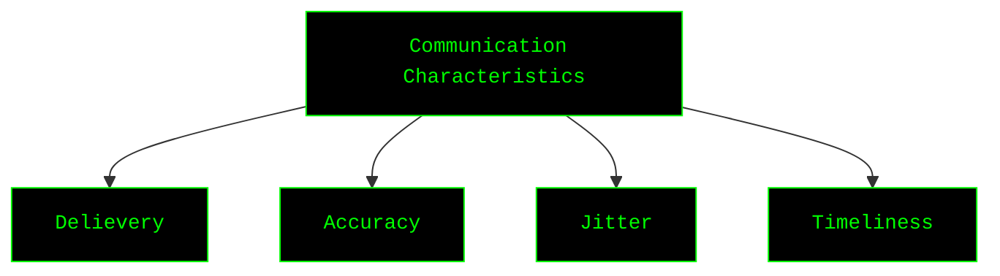
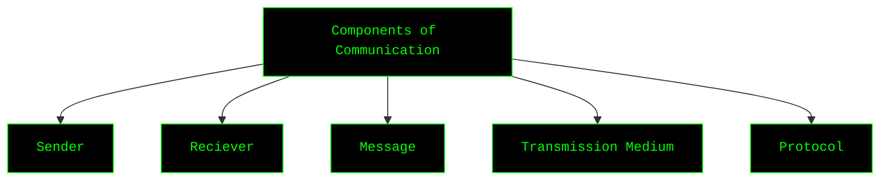
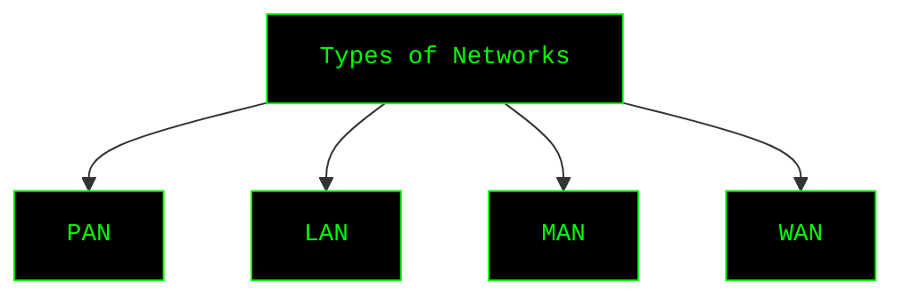
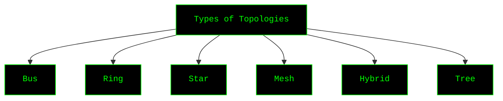
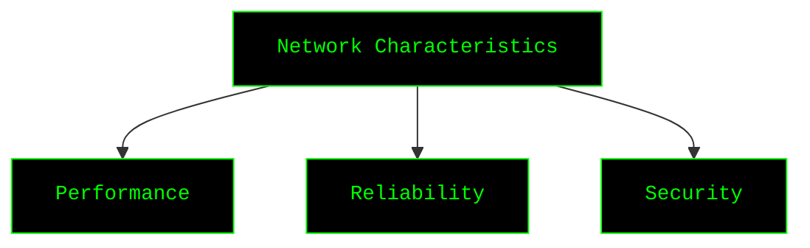
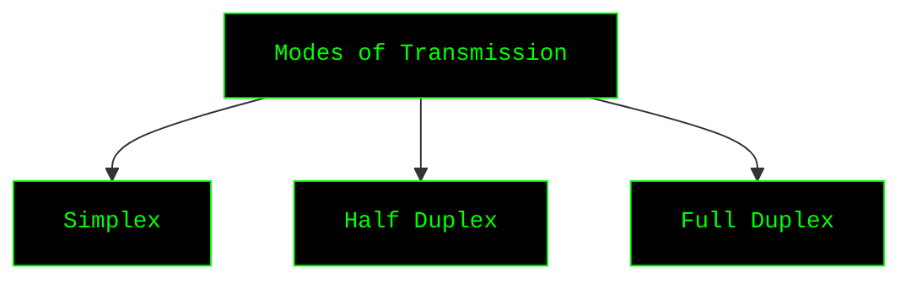
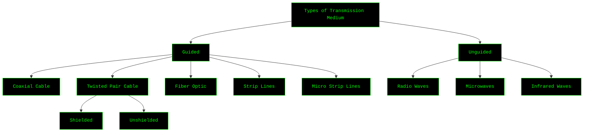
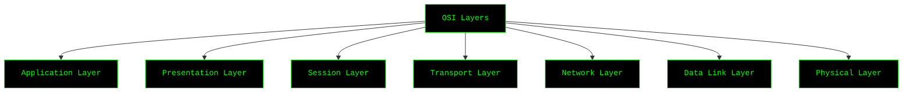
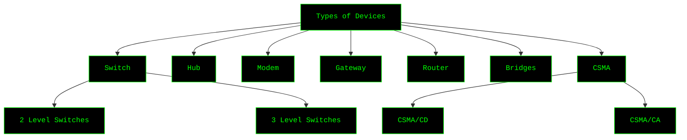
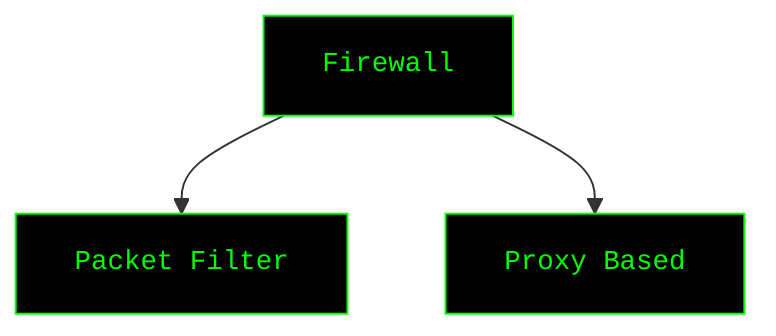

# Topics Teached

## 1. Communication Characteristics

---

## 2. Components of Communication

---

## 3. Types of Networks

---

## 4. Types of Topologies

---

## 5. Network Characteristics

---

## 6. Modes of Transmission

---

## 7. Types of Transmission Medium

---

## 8. OSI Layers

---

## 9. Types of Devices

---

## 10. Firewall and its Types

---
