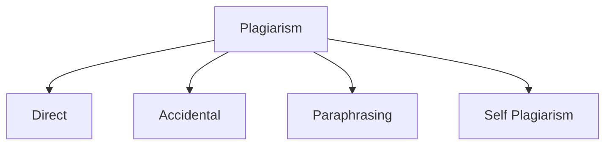

# 1. Plagiarism

Plagiarism is academic theft. It occurs when you use another person's intellectual property, such as their text, ideas, or research findings, and present it as your own work without giving them credit. The key rule to remember is that you are always allowed to use other people's ideas, but you must credit the original author. If you do not give credit, it is considered plagiarism. A common rule is to keep similarities to other work below 20%, but you should always check your institution's specific guidelines. The best solution to avoid plagiarism is to paraphrase the source material and always provide a proper citation.

## 1.1. Types of Plagiarism

### 1.1.1. Direct Plagiarism

Copying text word-for-word (verbatim) from a source without giving credit.

#### 1.1.2. Paraphrasing

Changing a few words or the sentence structure of someone else's idea but **not giving them credit.**

#### 1.1.3. Self Plagiarism

When we add our own research done in past without crediting it, is called self plagiarism.

#### 1.1.4. Accidental Plagiarism

It is accidentally happened plagiarism. We accidentally forgot to credit the author of the idea we have taken.

### 1.2. Why plagiarism is academic theft?

- It is unethical
- Maybe the author or researcher, whose data we are using without permission, might take it negatively.
