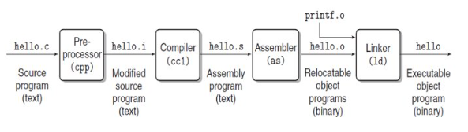
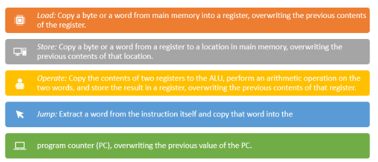

# Lecture 1

## Flash Cards

**Q1: What does a computer system consist of?**
🅰️ Hardware and system software that work together to run application programs.

---

**Q2: What is ASCII?**
🅰️ A standard that maps characters to integer values using 8-bit representations.

---

**Q3: What is a binary file?**
🅰️ A file that stores data in binary (non-text) format, such as executables or images.

---

**Q4: What is the role of the operating system in a computer system?**
🅰️ It manages hardware resources and system-level software operations.

---

**Q5: What are the four main phases of the compilation system?**
🅰️ Preprocessing, Compilation, Assembly, Linking.

---

**Q6: What is the job of the preprocessor?**
🅰️ It handles directives like `#include`, expands macros, and removes comments.

---

**Q7: What file is generated after preprocessing?**
🅰️ `.i` file (e.g., `hello.i`)

---

**Q8: What tool converts C code to assembly code?**
🅰️ `cc1` (the compiler)

---

**Q9: What file does the compiler output?**
🅰️ `.s` file (e.g., `hello.s`)

---

**Q10: What does the assembler do?**
🅰️ Converts assembly code to machine code → `.o` file

---

**Q11: What is the linker's role?**
🅰️ Combines object files and libraries to produce the final executable.

---

**Q12: What is the CPU?**
🅰️ The Central Processing Unit — it fetches, decodes, and executes instructions.

---

**Q13: What is the Program Counter (PC)?**
🅰️ A register that holds the memory address of the next instruction to execute.

---

**Q14: What does the ALU do?**
🅰️ Performs arithmetic and logic operations.

---

**Q15: What are registers?**
🅰️ Fast, small storage units in the CPU used for quick access to data.

---

**Q16: What is the instruction execution cycle?**
🅰️ Fetch → Decode → Execute → Repeat

---

**Q17: What happens when we run `./hello`?**
🅰️ The OS loads it into memory, and the CPU starts executing its instructions.

---

**Q18: What is the purpose of cache memory?**
🅰️ To store frequently accessed data closer to the CPU for faster access.

---

**Q19: Why do systems use a hierarchy of storage devices?**
🅰️ To balance speed and cost — faster devices are smaller and more expensive.

---

**Q20: Which is faster: cache, RAM, or disk?**
🅰️ Cache > RAM > Disk

---

**Q21: What is the bottleneck in many programs?**
🅰️ Moving data between components (e.g., from disk to RAM or RAM to CPU)

---

**Q22: Why does "copying" slow down performance?**
🅰️ Because data has to move between different levels of memory hierarchy, which takes time.

---

**Q23: What is the file extension of a C source file?**
🅰️ .c

---

## Question and Explanations

### 1. Compilation Process



### Step 1: **We Write the Source Code**

```c
#include <stdio.h>

int main() {
    printf("hello, world\n");
    return 0;
}
```

* Stored as `hello.c`
* Written in human-readable **C language**
* Stored on disk as a **text file** using **ASCII encoding**

---

### Step 2: **Now Compilation System Starts**

#### **Compilation Phases and Tools**

| Phase         | Tool Used | Output File | Description                                                                |
| ------------- | --------- | ----------- | -------------------------------------------------------------------------- |
| Preprocessing | `cpp`     | `hello.i`   | Handles `#include`, macros. Produces a new C file with included headers.   |
| Compilation   | `cc1`     | `hello.s`   | Translates `.i` into **assembly language**.                                |
| Assembly      | `as`      | `hello.o`   | Converts assembly into **machine code** in an **object file**              |
| Linking       | `ld`      | `hello`     | Combines `hello.o` and libraries (like `printf.o`) into an executable file |

---

#### Preprocessing (cpp)

* It Expands macros.
* Inserts contents of `#include <stdio.h>`.
* Strips comments.
* It generates a `.i` File.

#### Compilation (cc1)

* Converts expanded C code to **assembly language** and generate a `.s` File.

```asm
main:
    subq $8, %rsp
    movl $.LC0, %edi
    call puts
    movl $0, %eax
    addq $8, %rsp
    ret
```

#### Assembler (as)

* Converts `.s` file to **machine instructions** (binary format).
* Output: `.o` File.

#### Linking (ld)

* Resolves calls like `printf()` from libraries
* Combines everything into one executable: `hello.exe` or `hello`

---

## Loading and Execution



### Step 3: **Loading the Program into Memory**

* OS loads the `hello` executable from disk to **RAM (main memory)**.
* The **Program Counter (PC)** in the CPU is set to the address of the first instruction.

---

### Step 4: **Execution by Processor**

* The CPU reads instructions one by one using PC.
* Instructions are decoded and executed (using **ALU**, **Registers**).
* Example: output is written to display.

---

### Step 5: **Why Caches Matter**

* Data & instructions are often reused.
* **Caches** store frequently accessed values near the CPU.
* Improves speed by reducing trips to slower RAM/disk.

---
