# 3rd Chapter

## $$\text{Analog Signals}$$

Analog signal has infinitely many levels of intensity over a period of time.

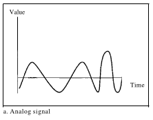

---

## $$\text{Digital Signals}$$

A digital signal, on the other hand, can have only a limited number of defined values. Although each value can be any number, it is often as simple as 1 and O.

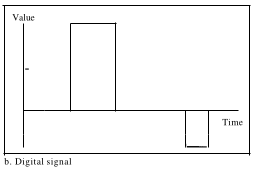

---

## $$\text{Periodic Signals}$$

A periodic signal completes a pattern within a measurable time frame, called a period, and repeats that pattern over subsequent identical periods.

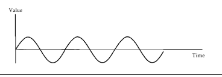

---

## $$\text{Non-Periodic Signals}$$

A nonperiodic signal changes without exhibiting a pattern or cycle that repeats over time.

---

## $$\text{Peak Amplitude}$$

The peak amplitude of a signal is the absolute value of its highest intensity, proportional to the energy it carries. For electric signals, peak amplitude is normally measured
in volts.

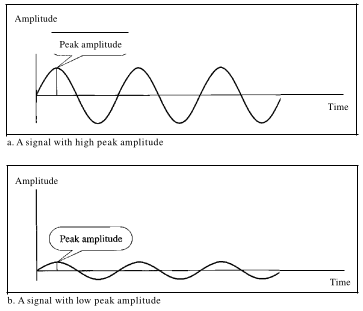

---

## $$\text{Period}$$

Period refers to the amount of time, in seconds, a signal needs to complete 1 cycle.

$$T = \frac{1}{f}$$

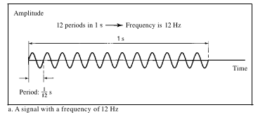

---

## $$\text{Frequency}$$

Period refers to the amount of time, in seconds, a signal needs to complete 1 cycle.

$$f = \frac{1}{T}$$

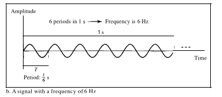

---

## $$\text{Units of Period and Frequency}$$

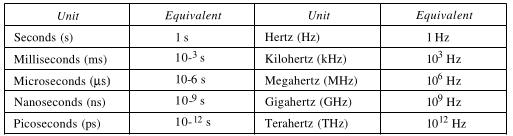

---

## $$\text{Phase}$$

The term phase describes the position of the waveform relative to time O. Phase is measured in degrees or radians [360° is 2n rad; 1° is 2n/360 rad, and 1 rad
is 360/(2n)].

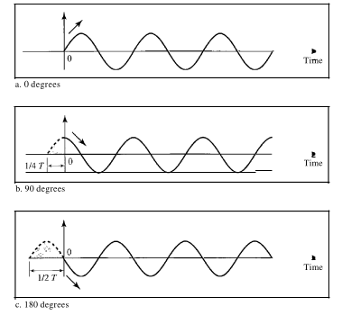

---

## $$\text{Wavelength}$$

The distance one cycle occupies on the transmission medium.

$$Wavelength = \text{propagation speed } × \text{period} = \frac{propagations speed}{frequency}$$

---

## $$\text{Composite Signals}$$

Composite signals are combination of simple sine waves with different frequencies, amplitudes, and phases.

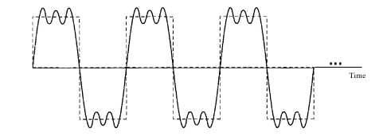

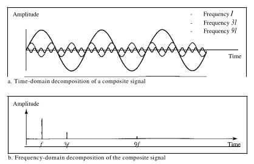

---

## $$\text{Bandwidth}$$

The bandwidth of a composite signal is the difference between the highest and the lowest frequencies contained in that signal.

$$B = fh - fl$$

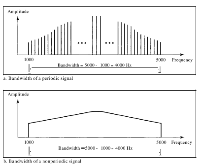

---

## $$\text{Bit Rate}$$

The bit rate is the number of bits sent in Is, expressed in bits per second (bps).

$$
\text{Bitrate} = \text{Pages per Minute} \times \text{Lines per Page} \times \text{Characters per Line} \times \text{Bits per Character}
$$

---

## $$\text{Bit Length}$$

The bit length is the distance one bit occupies on the transmission medium.

$$Bit length = \text{propagation speed} \times \text{bit duration}$$

---

## $$\text{Baseband Transmission}$$

Baseband transmission means sending a digital signal over a channel without changing the digital signal to an analog signal.

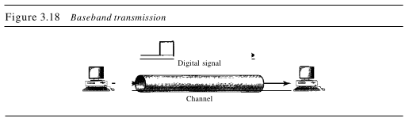

---

## $$\text{Attenuation}$$

Attenuation means a loss of energy. When a signal, simple or composite, travels through a medium, it loses some of its energy in overcoming the resistance of the medium.

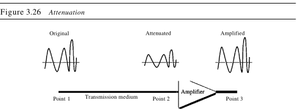

---

## $$\text{Decibel}$$

To show that a signal has lost or gained strength, engineers use the unit of the decibel. The decibel (dB) measures the relative strengths of two signals or one signal at two different points. Note that the decibel is negative if a signal is attenuated and positive if a signal is amplified.

$$dB = 10log_{10}\frac{P2}{P1}$$

---

## $$\text{Distortion}$$

Distortion means that the signal changes its form or shape. Distortion can occur in a composite signal made of different frequencies. Each signal component has its own propagation speed  through a medium and, therefore, its own delay in arriving at the final destination.

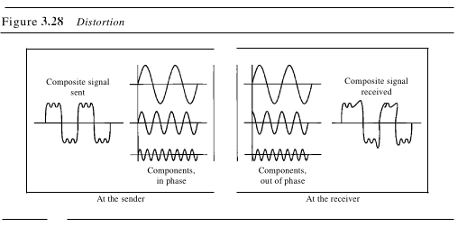

---

## $$\text{Noise}$$

Noise is another cause of impairment. Several types of noise, such as thermal noise, induced noise, crosstalk, and impulse noise, may corrupt the signal. **Thermal noise** is the random motion of electrons in a wire which creates an extra signal not originally sent by the transmitter. **Induced noise** comes from sources such as motors and appliances. **Crosstalk** is the effect of one wire on the other. One wire acts as a sending antenna and the other as the receiving antenna. Impulse noise is a spike (a signal with high energy in a very short time) that comes from power lines, lightning, and so on.

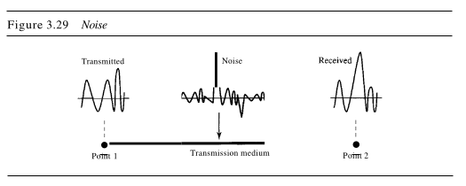

---