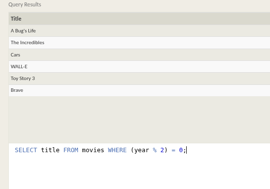
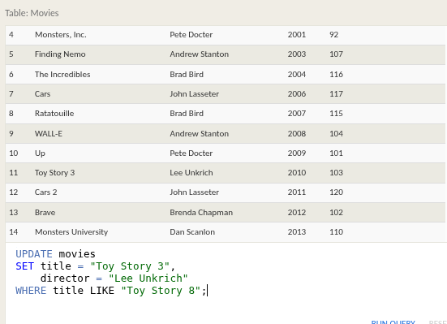

# SQL Lesson 1: SELECT queries

To retrieve data from a SQL database, we need to write SELECT statements, which are often colloquially refered to as queries. A query in itself is just a statement which declares what data we are looking for, where to find it in the database, and optionally, how to transform it before it is returned. It has a specific syntax though, which is what we are going to learn in the following exercises.

As we mentioned in the introduction, you can think of a table in SQL as a type of an entity (ie. Dogs), and each row in that table as a specific instance of that type (ie. A pug, a beagle, a different colored pug, etc). This means that the columns would then represent the common properties shared by all instances of that entity (ie. Color of fur, length of tail, etc).

And given a table of data, the most basic query we could write would be one that selects for a couple columns (properties) of the table with all the rows (instances).

Select query for a specific columns

```sql
SELECT column, another_column, …
FROM mytable;
```

The result of this query will be a two-dimensional set of rows and columns, effectively a copy of the table, but only with the columns that we requested.

If we want to retrieve absolutely all the columns of data from a table, we can then use the asterisk (*) shorthand in place of listing all the column names individually.

Select query for all columns

```sql
SELECT * 
FROM mytable;
```

This query, in particular, is really useful because it's a simple way to inspect a table by dumping all the data at once.

## Exercise

We will be using a database with data about some of Pixar's classic movies for most of our exercises. This first exercise will only involve the Movies table, and the default query below currently shows all the properties of each movie. To continue onto the next lesson, alter the query to find the exact information we need for each task.


### Find the Title of each film

```sql
SELECT Title FROM movies;
```


### Find the director of each film

```sql
SELECT Director FROM movies;
```


### Find the title and director of each film

```sql
SELECT Title, Director FROM movies;
```


### Find the title and year of each film

```sql
SELECT Title, Year FROM movies;
```


### Find all the information about each film

```sql
SELECT * FROM movies;
```


---

# SQL Lesson 2: Queries with constraints (Pt. 1)

Now we know how to select for specific columns of data from a table, but if you had a table with a hundred million rows of data, reading through all the rows would be inefficient and perhaps even impossible.

In order to filter certain results from being returned, we need to use a WHERE clause in the query. The clause is applied to each row of data by checking specific column values to determine whether it should be included in the results or not.

```sql
SELECT column, another_column, …
FROM mytable
WHERE condition
    AND/OR another_condition
    AND/OR …;
```

More complex clauses can be constructed by joining numerous AND or OR logical keywords (ie. num_wheels >= 4 AND doors <= 2). And below are some useful operators that you can use for numerical data (ie. integer or floating point):


In addition to making the results more manageable to understand, writing clauses to constrain the set of rows returned also allows the query to run faster due to the reduction in unnecessary data being returned.

> Did you know?
> As you might have noticed by now, SQL doesn't require you to write the keywords all capitalized, but as a convention, it helps people distinguish SQL keywords from column and tables names, and makes the query easier to read.

## Exercise

Using the right constraints, find the information we need from the Movies table for each task below.

> We have the same database "movies" as above

### Find the movie with a row id of 6

```sql
SELECT * FROM movies
WHERE id = 6;
```

##### OR

```sql
SELECT * FROM movies WHERE id = 6;
```


### Find the movies released in the years between 2000 and 2010

```sql
SELECT * FROM movies WHERE Year BETWEEN 2000 AND 2010;
```


### Find the movies not released in the years between 2000 and 2010

```sql
SELECT * FROM movies WHERE Year NOT BETWEEN 2000 AND 2010;
```


### Find the first 5 Pixar movies and their release year

```sql
SELECT Title, Year FROM movies WHERE id < 6;
```

##### OR

```sql
SELECT Title, Year FROM movies LIMIT 5;
```


---

# SQL Lesson 3: Queries with constraints (Pt. 2)

When writing WHERE clauses with columns containing text data, SQL supports a number of useful operators to do things like case-insensitive string comparison and wildcard pattern matching. We show a few common text-data specific operators below:


> Did you know?
> All strings must be quoted so that the query parser can distinguish words in the string from SQL keywords.

We should note that while most database implementations are quite efficient when using these operators, full-text search is best left to dedicated libraries like Apache Lucene or Sphinx. These libraries are designed specifically to do full text search, and as a result are more efficient and can support a wider variety of search features including internationalization and advanced queries.

## Exercise

Here's the definition of a query with a WHERE clause again, go ahead and try and write some queries with the operators above to limit the results to the information we need in the tasks below.

```sql
SELECT column, another_column, …
FROM mytable
WHERE condition
    AND/OR another_condition
    AND/OR …;
```

### Find all the Toy Story movies

```sql
SELECT title, director FROM movies WHERE title LIKE "Toy Story";
```

Given code matches only the title that is exactly "Toy Story"

```sql
SELECT title, director FROM movies WHERE title LIKE "Toy Story%";
```

Matches any title that starts with "Toy Story" — like "Toy Story 2", "Toy Story 3", etc.


### Find all the movies directed by John Lasseter

```sql
SELECT title, director FROM movies WHERE director LIKE "John Lasseter%";
```


### Find all the movies (and director) not directed by John Lasseter

```sql
SELECT title, director FROM movies WHERE director NOT LIKE "John Lasseter%";
```


### Find all the WALL-* movies

```sql
SELECT title FROM movies WHERE title LIKE "WALL%";
```


---

# SQL Lesson 4: Filtering and sorting Query results

Even though the data in a database may be unique, the results of any particular query may not be – take our Movies table for example, many different movies can be released the same year. In such cases, SQL provides a convenient way to discard rows that have a duplicate column value by using the DISTINCT keyword.

Select query with unique results

```sql
SELECT DISTINCT column, another_column, …
FROM mytable
WHERE condition(s);
```

Since the DISTINCT keyword will blindly remove duplicate rows, we will learn in a future lesson how to discard duplicates based on specific columns using grouping and the GROUP BY clause.

## Ordering results

Unlike our neatly ordered table in the last few lessons, most data in real databases are added in no particular column order. As a result, it can be difficult to read through and understand the results of a query as the size of a table increases to thousands or even millions rows.

To help with this, SQL provides a way to sort your results by a given column in ascending or descending order using the ORDER BY clause.

Select query with ordered results

```sql
SELECT column, another_column, …
FROM mytable
WHERE condition(s)
ORDER BY column ASC/DESC;
```

When an ORDER BY clause is specified, each row is sorted alpha-numerically based on the specified column's value. In some databases, you can also specify a collation to better sort data containing international text.

## Limiting results to a subset

Another clause which is commonly used with the ORDER BY clause are the LIMIT and OFFSET clauses, which are a useful optimization to indicate to the database the subset of the results you care about.
The LIMIT will reduce the number of rows to return, and the optional OFFSET will specify where to begin counting the number rows from.

Select query with limited rows

```sql
SELECT column, another_column, …
FROM mytable
WHERE condition(s)
ORDER BY column ASC/DESC
LIMIT num_limit OFFSET num_offset;
```

If you think about websites like Reddit or Pinterest, the front page is a list of links sorted by popularity and time, and each subsequent page can be represented by sets of links at different offsets in the database. Using these clauses, the database can then execute queries faster and more efficiently by processing and returning only the requested content.

> Did you know?
> If you are curious about when the LIMIT and OFFSET are applied relative to the other parts of a query, they are generally done last after the other clauses have been applied. We'll touch more on this in Lesson 12: Order of execution after introducting a few more parts of the query.

## Exercise

There are a few concepts in this lesson, but all are pretty straight-forward to apply. To spice things up, we've gone and scrambled the Movies table for you in the exercise to better mimic what kind of data you might see in real life. Try and use the necessary keywords and clauses introduced above in your queries.

### List all directors of Pixar movies (alphabetically), without duplicates 

```sql
SELECT DISTINCT director FROM movies ORDER BY director ASC;
```


### List the last four Pixar movies released (ordered from most recent to least)

```sql
SELECT title, year FROM movies ORDER BY year DESC LIMIT 4;
```


### List the first five Pixar movies sorted alphabetically

```sql
SELECT title FROM movies ORDER BY title ASC LIMIT 5;
```


### List the next five Pixar movies sorted alphabetically

```sql
SELECT title FROM movies ORDER BY title ASC LIMIT 5 OFFSET 5;
```


---

# SQL Review: Simple SELECT Queries (With Different DataBase)

We've done a good job getting to this point! Now that we've gotten a taste of how to write a basic query, we need to practice writing queries that solve actual problems.

```sql
SELECT column, another_column, …
FROM mytable
WHERE condition(s)
ORDER BY column ASC/DESC
LIMIT num_limit OFFSET num_offset;
```

## Exercise

In the exercise below, you will be working with a different table. This table instead contains information about a few of the most populous cities of North America[1] including their population and geo-spatial location in the world.

> Did you know?
> Positive latitudes correspond to the northern hemisphere, and positive longitudes correspond to the eastern hemisphere. Since North America is north of the equator and west of the prime meridian, all of the cities in the list have positive latitudes and negative longitudes.

Try and write some queries to find the information requested in the tasks below. You may have to use a different combination of clauses in your query for each task. Once you're done, continue onto the next lesson to learn about queries that span multiple tables.

#### New Data Base


### List all the Canadian cities and their populations

```sql
SELECT city, population FROM north_american_cities WHERE country = 'Canada';
```


### Order all the cities in the United States by their latitude from north to south 

First know the north, south, east and west from latitude and longitude

| Coordinate    | Range        | Meaning                                      |
| ------------- | ------------ | -------------------------------------------- |
| **Latitude**  | -90 to +90   | Measures **North/South** of the equator      |
| **Longitude** | -180 to +180 | Measures **East/West** of the Prime Meridian |

```sql
SELECT city FROM north_american_cities WHERE country LIKE "united%" ORDER BY latitude DESC;
```


### List all the cities west of Chicago, ordered from west to east

As we have to go west to east so we see longitude and also we have given as specific city so we are comparing all other cities with the longitude of that particular city.

```sql
SELECT city, longitude FROM north_american_cities
WHERE longitude < -87.629798
ORDER BY longitude ASC;
```


### List the two largest cities in Mexico (by population)

```sql
SELECT city, population FROM north_american_cities WHERE country = "Mexico" ORDER BY population DESC LIMIT 2;
```


### List the third and fourth largest cities (by population) in the United States and their population

As we have to list two cities in the united states which are third and fourth largest, so we arrange in descending order by population then we have to display two rows so we set LIMIT to 2 and also we have to display only third and fourth row so we set OFFSET to 2 i.e. it displays by skipping first two rows and displaying 3 and 4 row.

```sql
SELECT city, population FROM north_american_cities WHERE country LIKE "united%" ORDER BY population DESC LIMIT 2 OFFSET 2;
```


---

# SQL Lesson 6: Multi-table queries with JOINs

Up to now, we've been working with a single table, but entity data in the real world is often broken down into pieces and stored across multiple orthogonal tables using a process known as normalization[1].

## Database normalization

Database normalization is useful because it minimizes duplicate data in any single table, and allows for data in the database to grow independently of each other (ie. Types of car engines can grow independent of each type of car). As a trade-off, queries get slightly more complex since they have to be able to find data from different parts of the database, and performance issues can arise when working with many large tables.

In order to answer questions about an entity that has data spanning multiple tables in a normalized database, we need to learn how to write a query that can combine all that data and pull out exactly the information we need.

## Multi-table queries with JOINs

Tables that share information about a single entity need to have a primary key that identifies that entity uniquely across the database. One common primary key type is an auto-incrementing integer (because they are space efficient), but it can also be a string, hashed value, so long as it is unique.

Using the JOIN clause in a query, we can combine row data across two separate tables using this unique key. The first of the joins that we will introduce is the INNER JOIN.

Select query with INNER JOIN on multiple tables

```sql
SELECT column, another_table_column, …
FROM mytable
INNER JOIN another_table 
    ON mytable.id = another_table.id
WHERE condition(s)
ORDER BY column, … ASC/DESC
LIMIT num_limit OFFSET num_offset;
```

The INNER JOIN is a process that matches rows from the first table and the second table which have the same key (as defined by the ON constraint) to create a result row with the combined columns from both tables. After the tables are joined, the other clauses we learned previously are then applied.

> Did you know?
> You might see queries where the INNER JOIN is written simply as a JOIN. These two are equivalent, but we will continue to refer to these joins as inner-joins because they make the query easier to read once you start using other types of joins, which will be introduced in the following lesson.

## Exercise

We've added a new table to the Pixar database so that you can try practicing some joins. The BoxOffice table stores information about the ratings and sales of each particular Pixar movie, and the Movie_id column in that table corresponds with the Id column in the Movies table 1-to-1. Try and solve the tasks below using the INNER JOIN introduced above.

### DataBases


### Find the domestic and international sales for each movie

```sql
SELECT Title, domestic_sales, international_sales FROM movies
INNER JOIN boxoffice
ON movies.id = boxoffice.movie_id;
```


### Show the sales numbers for each movie that did better internationally rather than domestically

```sql
SELECT Title, domestic_sales, international_sales FROM movies
INNER JOIN boxoffice
ON movies.id = boxoffice.movie_id
WHERE international_sales > domestic_sales;
```


### List all the movies by their ratings in descending order

```sql
SELECT Title, rating FROM movies
INNER JOIN boxoffice
ON movies.id = boxoffice.movie_id
ORDER BY rating DESC;
```


---

# SQL Lesson 7: OUTER JOINs

Depending on how you want to analyze the data, the INNER JOIN we used last lesson might not be sufficient because the resulting table only contains data that belongs in both of the tables.

If the two tables have asymmetric data, which can easily happen when data is entered in different stages, then we would have to use a LEFT JOIN, RIGHT JOIN or FULL JOIN instead to ensure that the data you need is not left out of the results.

Select query with LEFT/RIGHT/FULL JOINs on multiple tables

```sql
SELECT column, another_column, …
FROM mytable
INNER/LEFT/RIGHT/FULL JOIN another_table 
    ON mytable.id = another_table.matching_id
WHERE condition(s)
ORDER BY column, … ASC/DESC
LIMIT num_limit OFFSET num_offset;
```

Like the INNER JOIN these three new joins have to specify which column to join the data on.
When joining table A to table B, a LEFT JOIN simply includes rows from A regardless of whether a matching row is found in B. The RIGHT JOIN is the same, but reversed, keeping rows in B regardless of whether a match is found in A. Finally, a FULL JOIN simply means that rows from both tables are kept, regardless of whether a matching row exists in the other table.

When using any of these new joins, you will likely have to write additional logic to deal with NULLs in the result and constraints (more on this in the next lesson).

> Did you know?
> You might see queries with these joins written as LEFT OUTER JOIN, RIGHT OUTER JOIN, or FULL OUTER JOIN, but the OUTER keyword is really kept for SQL-92 compatibility and these queries are simply equivalent to LEFT JOIN, RIGHT JOIN, and FULL JOIN respectively.

## Exercise

In this exercise, you are going to be working with a new table which stores fictional data about Employees in the film studio and their assigned office Buildings. Some of the buildings are new, so they don't have any employees in them yet, but we need to find some information about them regardless.

Since our browser SQL database is somewhat limited, only the LEFT JOIN is supported in the exercise below.

### Data Base


### Find the list of all buildings that have employees

```sql
SELECT DISTINCT building FROM employees;
```


### Find the list of all buildings and their capacity

```sql
SELECT building_name, capacity FROM buildings;
```


### List all buildings and the distinct employee roles in each building (including empty buildings) ✓

```sql
SELECT DISTINCT building_name, role 
FROM buildings 
  LEFT JOIN employees
    ON building_name = building;
```


---

# SQL Lesson 8: A short note on NULLs

As promised in the last lesson, we are going to quickly talk about NULL values in an SQL database. It's always good to reduce the possibility of NULL values in databases because they require special attention when constructing queries, constraints (certain functions behave differently with null values) and when processing the results.

An alternative to NULL values in your database is to have data-type appropriate default values, like 0 for numerical data, empty strings for text data, etc. But if your database needs to store incomplete data, then NULL values can be appropriate if the default values will skew later analysis (for example, when taking averages of numerical data).

Sometimes, it's also not possible to avoid NULL values, as we saw in the last lesson when outer-joining two tables with asymmetric data. In these cases, you can test a column for NULL values in a WHERE clause by using either the IS NULL or IS NOT NULL constraint.

Select query with constraints on NULL values

```sql
SELECT column, another_column, …
FROM mytable
WHERE column IS/IS NOT NULL
AND/OR another_condition
AND/OR …;
```

## Exercise

This exercise will be a sort of review of the last few lessons. We're using the same Employees and Buildings table from the last lesson, but we've hired a few more people, who haven't yet been assigned a building.

### Find the name and role of all employees who have not been assigned to a building

```sql
SELECT name, role FROM employees
WHERE building IS NULL;
```


### Find the names of the buildings that hold no employees

```sql
SELECT DISTINCT building_name
FROM buildings 
  LEFT JOIN employees
    ON building_name = building
WHERE role IS NULL;
```


---

# SQL Lesson 9: Queries with expressions

In addition to querying and referencing raw column data with SQL, you can also use expressions to write more complex logic on column values in a query. These expressions can use mathematical and string functions along with basic arithmetic to transform values when the query is executed, as shown in this physics example.

Example query with expressions

```sql
SELECT particle_speed / 2.0 AS half_particle_speed
FROM physics_data
WHERE ABS(particle_position) * 10.0 > 500;
```

Each database has its own supported set of mathematical, string, and date functions that can be used in a query, which you can find in their own respective docs.

The use of expressions can save time and extra post-processing of the result data, but can also make the query harder to read, so we recommend that when expressions are used in the SELECT part of the query, that they are also given a descriptive alias using the AS keyword.

Select query with expression aliases

```sql
SELECT col_expression AS expr_description, …
FROM mytable;
```

In addition to expressions, regular columns and even tables can also have aliases to make them easier to reference in the output and as a part of simplifying more complex queries.

Example query with both column and table name aliases

```sql
SELECT column AS better_column_name, …
FROM a_long_widgets_table_name AS mywidgets
INNER JOIN widget_sales
  ON mywidgets.id = widget_sales.widget_id;
```

## Exercise

You are going to have to use expressions to transform the BoxOffice data into something easier to understand for the tasks below.

### List all movies and their combined sales in millions of dollars

```sql
SELECT title, (domestic_sales + international_sales) / 1000000 AS combined_sales FROM movies
INNER JOIN boxoffice
ON id = movie_id;
```

### OR

```sql
SELECT 
    movies.title,
    (boxoffice.domestic_sales + boxoffice.international_sales) / 1000000 AS combined_sales
FROM 
    movies
INNER JOIN 
    boxoffice
ON 
    movies.id = boxoffice.movie_id;

```


### List all movies and their ratings in percent 

### The Float One

```sql
SELECT title, (rating / 10) * 100 AS rating_percent FROM movies
INNER JOIN boxoffice
ON id = movie_id;
```


### The Integer One

```sql
SELECT title, rating * 10 AS rating_percent
FROM movies
  JOIN boxoffice
    ON movies.id = boxoffice.movie_id;
```


### List all movies that were released on even number years

```sql
SELECT title FROM movies WHERE (year % 2) = 0;
```



---

# SQL Lesson 10: Queries with aggregates (Pt. 1)


In addition to the simple expressions that we introduced last lesson, SQL also supports the use of aggregate expressions (or functions) that allow you to summarize information about a group of rows of data. With the Pixar database that you've been using, aggregate functions can be used to answer questions like, "How many movies has Pixar produced?", or "What is the highest grossing Pixar film each year?".

Select query with aggregate functions over all rows

```sql
SELECT AGG_FUNC(column_or_expression) AS aggregate_description, …
FROM mytable
WHERE constraint_expression;
```

Without a specified grouping, each aggregate function is going to run on the whole set of result rows and return a single value. And like normal expressions, giving your aggregate functions an alias ensures that the results will be easier to read and process.

### Common aggregate functions

Here are some common aggregate functions that we are going to use in our examples:


### Grouped aggregate functions

In addition to aggregating across all the rows, you can instead apply the aggregate functions to individual groups of data within that group (ie. box office sales for Comedies vs Action movies).
This would then create as many results as there are unique groups defined as by the GROUP BY clause.

Select query with aggregate functions over groups

```sql
SELECT AGG_FUNC(column_or_expression) AS aggregate_description, …
FROM mytable
WHERE constraint_expression
GROUP BY column;
```

The GROUP BY clause works by grouping rows that have the same value in the column specified.

## Exercise

For this exercise, we are going to work with our Employees table. Notice how the rows in this table have shared data, which will give us an opportunity to use aggregate functions to summarize some high-level metrics about the teams. Go ahead and give it a shot.

## DataBase


### Find the longest time that an employee has been at the studio

```sql
SELECT MAX(years_employed) FROM employees;
```


### For each role, find the average number of years employed by employees in that role

```sql
SELECT role, AVG(years_employed) as Average_years_employed
FROM employees
GROUP BY role;
```


### Find the total number of employee years worked in each building

```sql
SELECT building, SUM(years_employed) as Total_years_employed
FROM employees
GROUP BY building;
```


---

# SQL Lesson 11: Queries with aggregates (Pt. 2)

Our queries are getting fairly complex, but we have nearly introduced all the important parts of a SELECT query. One thing that you might have noticed is that if the GROUP BY clause is executed after the WHERE clause (which filters the rows which are to be grouped), then how exactly do we filter the grouped rows?

Luckily, SQL allows us to do this by adding an additional HAVING clause which is used specifically with the GROUP BY clause to allow us to filter grouped rows from the result set.

Select query with HAVING constraint

```sql
SELECT group_by_column, AGG_FUNC(column_expression) AS aggregate_result_alias, …
FROM mytable
WHERE condition
GROUP BY column
HAVING group_condition;
```

The HAVING clause constraints are written the same way as the WHERE clause constraints, and are applied to the grouped rows. With our examples, this might not seem like a particularly useful construct, but if you imagine data with millions of rows with different properties, being able to apply additional constraints is often necessary to quickly make sense of the data.

> Did you know?
> If you aren't using the `GROUP BY` clause, a simple `WHERE` clause will suffice.

## Exercise

For this exercise, you are going to dive deeper into Employee data at the film studio. Think about the different clauses you want to apply for each task.

### Find the number of Artists in the studio (without a HAVING clause)

```sql
SELECT COUNT(role) FROM employees
where role LIKE "Artist%";
```


### Find the number of Employees of each role in the studio

```sql
SELECT role, COUNT(name) FROM employees
GROUP BY role;
```


### Find the total number of years employed by all Engineers

```sql
Select SUM(years_employed) FROM employees
WHERE role LIKE "Engineer";
```


---

# SQL Lesson 12: Order of execution of a Query

Now that we have an idea of all the parts of a query, we can now talk about how they all fit together in the context of a complete query.

Complete SELECT query

```sql
SELECT DISTINCT column, AGG_FUNC(column_or_expression), …
FROM mytable
    JOIN another_table
      ON mytable.column = another_table.column
    WHERE constraint_expression
    GROUP BY column
    HAVING constraint_expression
    ORDER BY column ASC/DESC
    LIMIT count OFFSET COUNT;
```

Each query begins with finding the data that we need in a database, and then filtering that data down into something that can be processed and understood as quickly as possible. Because each part of the query is executed sequentially, it's important to understand the order of execution so that you know what results are accessible where.

## Query order of execution

### 1. FROM and JOINs

The FROM clause, and subsequent JOINs are first executed to determine the total working set of data that is being queried. This includes subqueries in this clause, and can cause temporary tables to be created under the hood containing all the columns and rows of the tables being joined.

### 2. WHERE

Once we have the total working set of data, the first-pass WHERE constraints are applied to the individual rows, and rows that do not satisfy the constraint are discarded. Each of the constraints can only access columns directly from the tables requested in the FROM clause. Aliases in the SELECT part of the query are not accessible in most databases since they may include expressions dependent on parts of the query that have not yet executed.

### 3. GROUP BY

The remaining rows after the WHERE constraints are applied are then grouped based on common values in the column specified in the GROUP BY clause. As a result of the grouping, there will only be as many rows as there are unique values in that column. Implicitly, this means that you should only need to use this when you have aggregate functions in your query.

### 4. HAVING

If the query has a GROUP BY clause, then the constraints in the HAVING clause are then applied to the grouped rows, discard the grouped rows that don't satisfy the constraint. Like the WHERE clause, aliases are also not accessible from this step in most databases.

### 5. SELECT

Any expressions in the SELECT part of the query are finally computed.

### 6. DISTINCT

Of the remaining rows, rows with duplicate values in the column marked as DISTINCT will be discarded.

### 7. ORDER BY

If an order is specified by the ORDER BY clause, the rows are then sorted by the specified data in either ascending or descending order. Since all the expressions in the SELECT part of the query have been computed, you can reference aliases in this clause.

### 8. LIMIT / OFFSET

Finally, the rows that fall outside the range specified by the LIMIT and OFFSET are discarded, leaving the final set of rows to be returned from the query.

### Conclusion

Not every query needs to have all the parts we listed above, but a part of why SQL is so flexible is that it allows developers and data analysts to quickly manipulate data without having to write additional code, all just by using the above clauses.

## Exercise

Here ends our lessons on SELECT queries, congrats of making it this far! This exercise will try and test your understanding of queries, so don't be discouraged if you find them challenging. Just try your best.

### Find the number of movies each director has directed

```sql
SELECT director,COUNT(title) FROM movies
GROUP BY director;
```


### Find the total domestic and international sales that can be attributed to each director

```sql
SELECT director, SUM(domestic_sales + international_sales) as Cumulative_sales_from_all_movies
FROM movies
    INNER JOIN boxoffice
        ON movies.id = boxoffice.movie_id
GROUP BY director;
```


---

# SQL Lesson 13: Inserting rows

We've spent quite a few lessons on how to query for data in a database, so it's time to start learning a bit about SQL schemas and how to add new data.

## What is a Schema?

We previously described a table in a database as a two-dimensional set of rows and columns, with the columns being the properties and the rows being instances of the entity in the table. In SQL, the database schema is what describes the structure of each table, and the datatypes that each column of the table can contain.

> Example: Correlated subquery
>
> For example, in our Movies table, the values in the Year column must be an Integer, and the values in the Title column must be a String.

This fixed structure is what allows a database to be efficient, and consistent despite storing millions or even billions of rows.

## Inserting new data

When inserting data into a database, we need to use an INSERT statement, which declares which table to write into, the columns of data that we are filling, and one or more rows of data to insert. In general, each row of data you insert should contain values for every corresponding column in the table. You can insert multiple rows at a time by just listing them sequentially.

Insert statement with values for all columns

```sql
INSERT INTO mytable
VALUES (value_or_expr, another_value_or_expr, …),
       (value_or_expr_2, another_value_or_expr_2, …),
       …;
In some cases, if you have incomplete data and the table contains columns that support default values, you can insert rows with only the columns of data you have by specifying them explicitly.

Insert statement with specific columns
INSERT INTO mytable
(column, another_column, …)
VALUES (value_or_expr, another_value_or_expr, …),
      (value_or_expr_2, another_value_or_expr_2, …),
      …;
```

In these cases, the number of values need to match the number of columns specified. Despite this being a more verbose statement to write, inserting values this way has the benefit of being forward compatible. For example, if you add a new column to the table with a default value, no hardcoded INSERT statements will have to change as a result to accommodate that change.

In addition, you can use mathematical and string expressions with the values that you are inserting.
This can be useful to ensure that all data inserted is formatted a certain way.

Example Insert statement with expressions

```sql
INSERT INTO boxoffice
(movie_id, rating, sales_in_millions)
VALUES (1, 9.9, 283742034 / 1000000);
```

### Exercise

In this exercise, we are going to play studio executive and add a few movies to the Movies to our portfolio. In this table, the Id is an auto-incrementing integer, so you can try inserting a row with only the other columns defined.

Since the following lessons will modify the database, you'll have to manually run each query once they are ready to go.

### Add the studio's new production, Toy Story 4 to the list of movies (you can use any director) 

```sql
INSERT INTO movies
(title,director,year,length_minutes)
VALUES ("Toy Story 4","Pete Docter",2025,45);
```


### Toy Story 4 has been released to critical acclaim! It had a rating of 8.7, and made 340 million domestically and 270 million internationally. Add the record to the BoxOffice table.

```sql
INSERT INTO boxoffice VALUES (4, 8.7, 340000000, 270000000);
```


---

# SQL Lesson 14: Updating rows

In addition to adding new data, a common task is to update existing data, which can be done using an UPDATE statement. Similar to the INSERT statement, you have to specify exactly which table, columns, and rows to update. In addition, the data you are updating has to match the data type of the columns in the table schema.

Update statement with values

```sql
UPDATE mytable
SET column = value_or_expr, 
    other_column = another_value_or_expr, 
    …
WHERE condition;
```

The statement works by taking multiple column/value pairs, and applying those changes to each and every row that satisfies the constraint in the WHERE clause.

## Taking care

Most people working with SQL will make mistakes updating data at one point or another. Whether it's updating the wrong set of rows in a production database, or accidentally leaving out the WHERE clause (which causes the update to apply to all rows), you need to be extra careful when constructing UPDATE statements.

One helpful tip is to always write the constraint first and test it in a SELECT query to make sure you are updating the right rows, and only then writing the column/value pairs to update.

## Exercise

It looks like some of the information in our Movies database might be incorrect, so go ahead and fix them through the exercises below.

### The director for A Bug's Life is incorrect, it was actually directed by John Lasseter

```sql
UPDATE movies
SET director = "John Lasseter"
WHERE title LIKE "A Bug's Life";
```


### The year that Toy Story 2 was released is incorrect, it was actually released in 1999

```sql
UPDATE movies
SET year = 1999
WHERE title LIKE "Toy Story 2";
```


### Both the title and director for Toy Story 8 is incorrect! The title should be "Toy Story 3" and it was directed by Lee Unkrich

```sql
UPDATE movies
SET title = "Toy Story 3",
    director = "Lee Unkrich"
WHERE title LIKE "Toy Story 8";
```



---

# SQL Lesson 15: Deleting rows

When you need to delete data from a table in the database, you can use a DELETE statement, which describes the table to act on, and the rows of the table to delete through the WHERE clause.

Delete statement with condition

```sql
DELETE FROM mytable
WHERE condition;
```

If you decide to leave out the WHERE constraint, then all rows are removed, which is a quick and easy way to clear out a table completely (if intentional).

## Taking extra care

Like the UPDATE statement from last lesson, it's recommended that you run the constraint in a SELECT query first to ensure that you are removing the right rows. Without a proper backup or test database, it is downright easy to irrevocably remove data, so always read your DELETE statements twice and execute once.

## Exercise

The database needs to be cleaned up a little bit, so try and delete a few rows in the tasks below.

### This database is getting too big, lets remove all movies that were released before 2005.

```sql

```