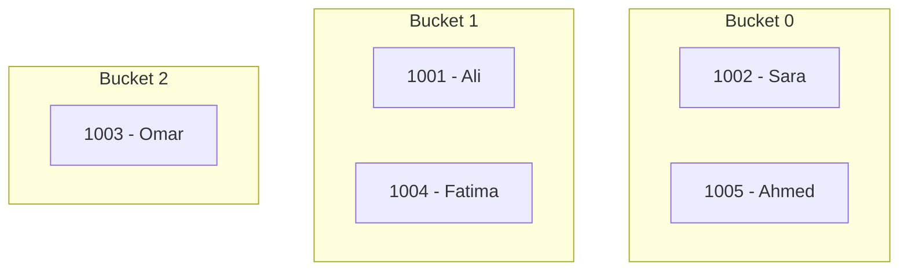
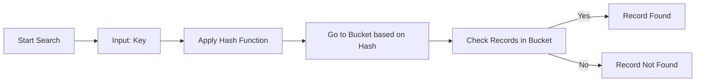

# sdf

---

Alright, let's prepare them step-by-step — **Journal → Ledger → Trial Balance** — following **American format** for clarity.

---

## **1️⃣ Journal Entries**

| Date       | Particulars                           | Debit (Rs.) | Credit (Rs.) |
| ---------- | ------------------------------------- | ----------- | ------------ |
| **1 Jan**  | Cash A/C                         | 95,000      |              |
|            |   To Capital A/C                      |             | 95,000       |
|            | *(Business started with cash)*        |             |              |
| **5 Jan**  | Purchases A/C                     | 40,000      |              |
|            |   To Cash A/C                         |             | 40,000       |
|            | *(Goods purchased for cash)*          |             |              |
| **11 Jan** | Purchases A/C                      | 57,000      |              |
|            |   To Accounts Payable – Big Traders   |             | 57,000       |
|            | *(Goods purchased on credit)*         |             |              |
| **20 Jan** | Cash A/C                          | 5,000       |              |
|            |   To Sales A/C                        |             | 5,000        |
|            | *(Goods sold for cash)*               |             |              |
| **23 Jan** | Office Equipment A/C              | 4,000       |              |
|            |   To Cash A/C                         |             | 4,000        |
|            | *(Purchased office equipment)*        |             |              |
| **26 Jan** | Bank A/C                          | 10,000      |              |
|            |   To Cash A/C                         |             | 10,000       |
|            | *(Cash deposited in bank)*            |             |              |
| **27 Jan** | Bank Charges A/C                  | 100         |              |
|            |   To Bank A/C                         |             | 100          |
|            | *(Bank charges paid)*                 |             |              |
| **29 Jan** | Accounts Receivable – Mohsin A/C Dr.  | 5,000       |              |
|            |   To Sales A/C                        |             | 5,000        |
|            | *(Goods sold to Mohsin on credit)*    |             |              |
|            | Cash A/C                          | 1,000       |              |
|            |   To Accounts Receivable – Mohsin     |             | 1,000        |
|            | *(Received part payment from Mohsin)* |             |              |
| **30 Jan** | Electricity Expense A/C           | 5,000       |              |
|            |   To Cash A/C                         |             | 5,000        |
|            | *(Electricity bill paid)*             |             |              |
| **31 Jan** | Salaries Expense A/C             | 3,000       |              |
|            |   To Bank A/C                         |             | 3,000        |
|            | *(Paid salaries from bank)*           |             |              |

---

## **2️⃣ Ledger Accounts** (Condensed Format)

**Cash A/C**

| Dr                         | Cr                           |
| -------------------------- | ---------------------------- |
| 1 Jan – Capital 95,000     | 5 Jan – Purchases 40,000     |
| 20 Jan – Sales 5,000       | 23 Jan – Office Equip. 4,000 |
| 29 Jan – Mohsin 1,000      | 26 Jan – Bank 10,000         |
| 30 Jan – Electricity 5,000 |                              |
| **Total Cr:** 59,000       |                              |
| **Balance c/d:** 42,000    |                              |

**Bank A/C**

| Dr                      | Cr                        |
| ----------------------- | ------------------------- |
| 26 Jan – Cash 10,000    | 27 Jan – Bank Charges 100 |
| 31 Jan – Salaries 3,000 |                           |
| **Balance c/d:** 6,900  |                           |

**Capital A/C**
Cr
--

1 Jan – Cash 95,000

**Purchases A/C**

| Dr                          | Cr |
| --------------------------- | -- |
| 5 Jan – Cash 40,000         | –  |
| 11 Jan – Big Traders 57,000 | –  |
| Total Dr: 97,000            |    |

**Accounts Payable – Big Traders A/C**
Cr
--

11 Jan – Purchases 57,000

**Sales A/C**
Cr
--

20 Jan – Cash 5,000
29 Jan – Mohsin 5,000
Total Cr: 10,000

**Office Equipment A/C**
Dr
--

23 Jan – Cash 4,000

**Bank Charges A/C**
Dr
--

27 Jan – Bank 100

**Accounts Receivable – Mohsin A/C**

| Dr                   | Cr                  |
| -------------------- | ------------------- |
| 29 Jan – Sales 5,000 | 29 Jan – Cash 1,000 |
| Balance c/d: 4,000   |                     |

**Electricity Expense A/C**
Dr
--

30 Jan – Cash 5,000

**Salaries Expense A/C**
Dr
--

31 Jan – Bank 3,000

---

## **3️⃣ Trial Balance as on 31 Jan**

| Account Title                  | Debit (Rs.) | Credit (Rs.) |
| ------------------------------ | ----------- | ------------ |
| Cash                           | 42,000      |              |
| Bank                           | 6,900       |              |
| Accounts Receivable – Mohsin   | 4,000       |              |
| Purchases                      | 97,000      |              |
| Office Equipment               | 4,000       |              |
| Bank Charges                   | 100         |              |
| Electricity Expense            | 5,000       |              |
| Salaries Expense               | 3,000       |              |
| Capital                        |             | 95,000       |
| Accounts Payable – Big Traders |             | 57,000       |
| Sales                          |             | 10,000       |
| **Total**                      | **162,000** | **162,000**  |

---

If you want, I can also **make this in an attractive PDF format** with proper headings, tables, and American accounting style.
Do you want me to prepare that now?
