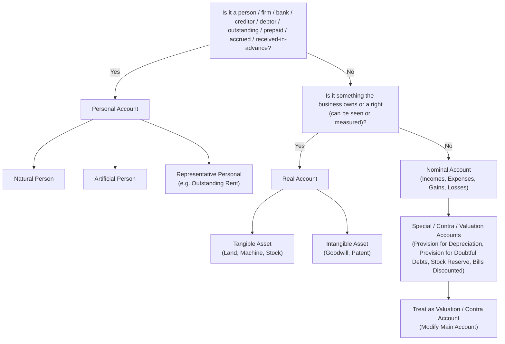
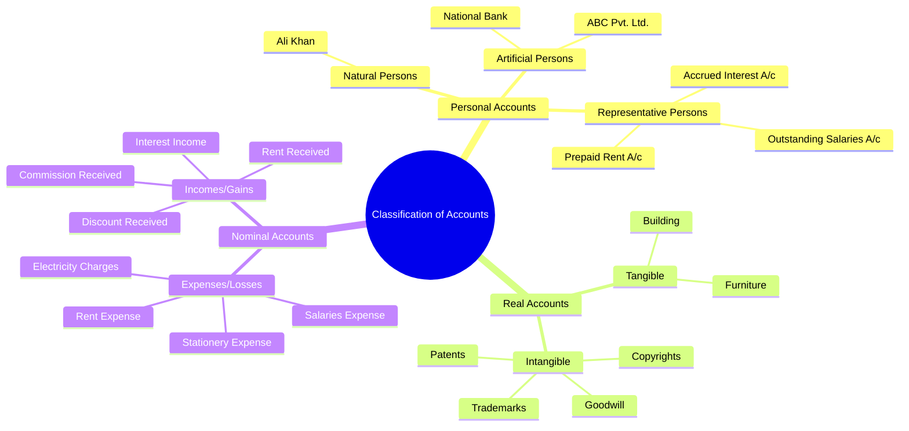

# $ Finance

## 1. Business Transactions

```mermaid
flowchart TD
    A["Is it a person / firm / bank / creditor / debtor / outstanding / prepaid / accrued / received-in-advance?"] -->|Yes| B["Personal Account"]
    B --> B1["Natural Person"]
    B --> B2["Artificial Person"]
    B --> B3["Representative Personal\n(e.g. Outstanding Rent)"]

    A -->|No| C["Is it something the business owns or a right\n(can be seen or measured)?"]
    C -->|Yes| D["Real Account"]
    D --> D1["Tangible Asset\n(Land, Machine, Stock)"]
    D --> D2["Intangible Asset\n(Goodwill, Patent)"]

    C -->|No| E["Nominal Account\n(Incomes, Expenses, Gains, Losses)"]

    E --> F["Special / Contra / Valuation Accounts\n(Provision for Depreciation, Provision for Doubtful Debts, Stock Reserve, Bills Discounted)"]
    F --> G["Treat as Valuation / Contra Account\n(Modify Main Account)"]

```

### 1.1. Internal Transactions

## 2. Classification of Accounts

```mermaid
mindmap
  root((Classification of Accounts))
    Personal Accounts
      Natural Persons
        Ali Khan
      Artificial Persons
        ABC Pvt. Ltd.
        National Bank
      Representative Persons
        Outstanding Salaries A/c
        Prepaid Rent A/c
        Accrued Interest A/c
    Real Accounts
      Tangible
        Building
        Furniture
      Intangible
        Goodwill
        Patents
        Trademarks
        Copyrights
    Nominal Accounts
      Expenses/Losses
        Rent Expense
        Salaries Expense
        Electricity Charges
        Stationery Expense
      Incomes/Gains
        Interest Income
        Commission Received
        Discount Received
        Rent Received
```

---

## 3
