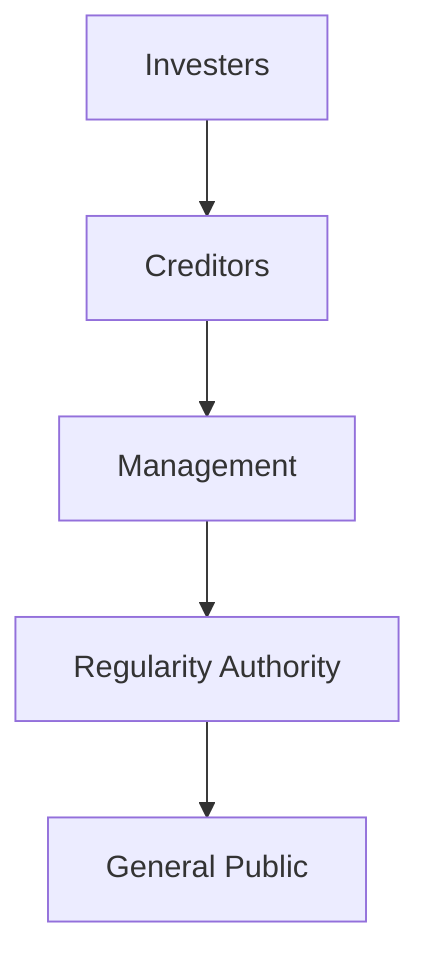

# Table of Contents

- [Table of Contents](#table-of-contents)
  - [What is Financial Accounting?](#what-is-financial-accounting)
    - [Account](#account)
    - [Transaction](#transaction)
    - [Bad Debts](#bad-debts)
    - [Sequence of Usage of Financial Accounting (Diagram)](#sequence-of-usage-of-financial-accounting-diagram)
    - [Liablility](#liablility)
    - [Journal](#journal)
    - [Ledger](#ledger)
    - [Business](#business)
    - [Proprietor](#proprietor)
    - [Capital](#capital)

---

## What is Financial Accounting?

> It is original form of accounting. It is recording, classifying and summarizing financial transactions fro the purpose of financial statment.

---

### Account

> Summarized and classified record of transaction.

---

### Transaction

> Any dealing between two or more persons.

---

### Bad Debts

> Bad debts are amounts of money that a business cannot recover because the person or company who owes the money has gone bankrupt, closed down, or is unwilling or unable to pay. This means the business has to treat that money as a loss.

---

### Sequence of Usage of Financial Accounting (Diagram)

---

### Liablility

> Liability means something a person or business owes to someone else. It is a legal or financial responsibility to pay money in the future. It means that a liability is money that we have to pay to others — like loans, bills, or anything we owe.

---

### Journal

> A journal is a daily book where all business transactions are written down in order of date.

---

### Ledger

> A ledger is an accounting record in which a separate account is prepared for each item or transaction category.

---

### Business

> Any legal activity which is undertaken to earn profit.

---

### Proprietor

> Owner of the business.

---

### Capital

> Ammount invested in business. **OR** The amount with which trader start his/her business. It is also referred as **Owner Equity**.

---
