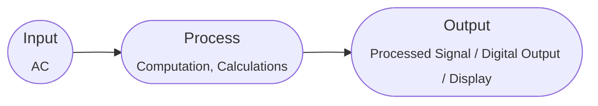

# Automata Notes

## Automata

Automata is a greek word which means **Machines**. In theory of Automata we design machines.

> Automata is the plural of automaton which means "something that works automatically."

---

## Machines

Anything that can ease up the task to be performed by human beings.

In general a machine has following diagram:

---

## Categories of Machines

---

### 1. Mechanical Machine

* It's Input is Force
* Processing is preformed by Gears and Pulleys
* It's output is work done i.e. Physical displacement of object.

### 2. Electrical Machine

### 3. Electronic Machine

---

## Logical Machines

All machines which do not have physical presence. Logical machines are programmed machines i.e.  Designing a machine using boolean algebra.

> Automata is also a logical machine i.e. Compiler, Assembler, Search Engine etc.

---

## Languages

Language is a collection of symbols & rules which are used to combine these symbols and words to form words & meaningful sentences.

---

## Types of Languages

### 1. Formal Languages

These are the languages which have some syntax. For Example C++, Urdu, English etc.

### 2. Informal Languages

These are the languages which have not syntax at all. For Example natural language, sign language, emojis, or visual interfaces.

---

## Alphabet

A finite non-empty set of symbols(letters). It is denoted by Greek Symbol Sigma ($\sum$).
For Example:

1. $$\sum = \{a\}$$
2. $$\sum = \{0,1\}$$

> Do You Know
>
> **ALGOL** is a language which has 113 letters in it because it includes letters, digits & a variety of operators such as **GOTO** and **IF**.

---

## Strings

Concatenation of finite symbols from the alphabets.
For Example:

Let $$\sum = \{a,b\}$$

then,

$$ \{ \text{a, abab, ababababababab,} \cdots \} \text{ is a set of strings}$$

---

## Length of Strings

Let $$\sum = \{B,aB,bab,d\}$$
and a string $$s = \{BaBbabBd\}$$

then the length of string is obtained by counting the symbols in it so in the given string we have

$$(B), (aB),(bab),(d)$$

So, $|s| = 1 + 1 + 1 + 1 = 4$

## Valid or INvlaid Word (Sir has teach us as Alphabet not Word)

Lets take an example

$$\sum = \{B,Ba,bab,d\}$$

and a string

$$s = \{BababB\}$$

* The given string can be tokenized into two different ways

1. $$(Ba), (bab),(B)$$
2. $$(B), (abab),(B)$$

* So from the tokenizing we come to know that the $1^{st}$ tokenization is from the given alphabet cause all tokens in the $1^{st}$ $\in$ to set of Alphabets given.

* Butt for second we come to know that it doesn't $\in$ to set of given Alphabets cause the second token i.e. $abab$ doesn't $\in$ to set of Alphabets given.

> **Note**:
> As when the string is scanned by the compiler (Lexical Analayzer), $1^{st}$ **B** is identified as a letter, the lexical analyzer would not be able to identify, So while defining on alphabet it should be kept in mind that ambiguity should not be created.

> **Remarks**
> While defining an alphabet of letters consisiting of more than one symbols, not letter should be started with the letter of the same alphabet i.e. One letter should not be the prefix of another. However a letter may be ended with the letter of same alphabet i.e. one letter maybe the suffix of another.

---

## Reverse of the String

The reverse of a string S is denoted by $Rev(s)$ or $S^r$, is obtained by writing the letters of S in reverse order.

* If $S = abc$ is a string over $$\sum = \{a,b,c\}$$ the $Rev(s)$ $= cba$

* If $$\sum = \{B,aB,bab,d\}$$ and $s = BaBbabBd$

Tokenized String = $$(B), (aB),(bab),(B),(d)$$

Lets Reverse it,

$Rev(s)$ $= dBbabaBB$\

---

## Defining Languages

The languages can be defined in different ways, such as **Descriptive Definition**, **Recursive Definition**, **Using Regular Expressions (RE)** & **Using Finite Automation (FA)** etc.

---

## Descriptive Definintion

The language is defined, describing the conditons imposed on its words.

1. Let us consider Language **L** of strings of odd length defined over alphabet $\sum = \{a\}$ can be written as $L = \{ a, aaa, aaaaa, \cdots\}$

2.  Let us consider another Language **L** that does not start with a, defined over $\sum = \{a,b,c\}$ can be written as $$L = \{b,c,ba,bb,ca,cb,ce,\cdots\}$$
3. Let us Consider language **L** of strings of length **2** over $\sum \{0,1,2\}$ can be written as $L = \{00,01,02,10,11,12,20,21,22\}$
4. Let us consider language **L** of strings Integer defined over $\sum \{-,0,1,2,3,4,5,6,7,8,9\}$ can be written as $INTEGER = \{\cdots \cdots -2,-1,0,1,2\}$
5. Let us consider language $L(a^nb^n)$ of string defined over $\sum \{a,b\}$ can be written as $\{a^nb^n\: 1,2,3,4,5,\cdots\}$ or $\{ab,aabb,\cdots \}$
6. Let us consider a language **Factorial(n!)** over $\{1,2,3,4,5,6,7,8,9\}$ can we defined as $\{n!: 1,2,3,4,5,6,7,8,9\}$ or $\{1,2,6,24,120,\cdots\}$
7. Lets us consider another language $FACTORIAL (a^{n!})$ over $\sum = \{a\}$ can be written as $\{a^{n!}: 1,2,3,4,5,\cdots\}$ or j$\{a,aa,aaa,aaaa,aaaaa,\cdots\}$

---

$\quad\quad\quad\quad\quad\quad\quad \text{For Now That's It } \cdot \quad\quad\quad\quad\quad\quad\quad$