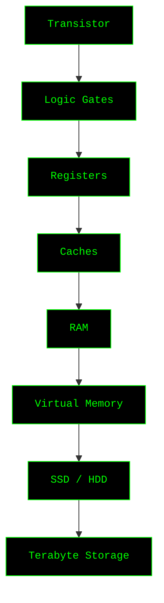

```mermaid
graph TD
    A[Transistor<br>] --> B[Logic Gates<br>]
    B --> C[Registers<br>]
    C --> D[Caches<br>]
    D --> E[RAM<br>]
    E --> F[Virtual Memory]
    F --> G[SSD / HDD<br>]
    G --> H[Terabyte Storage<br>]
    
    classDef nodeStyle fill:#000,color:#0f0,stroke:#0f0,font-family:Courier,font-size:14px;
    class A,B,C,D,E,F,G,H nodeStyle;
```